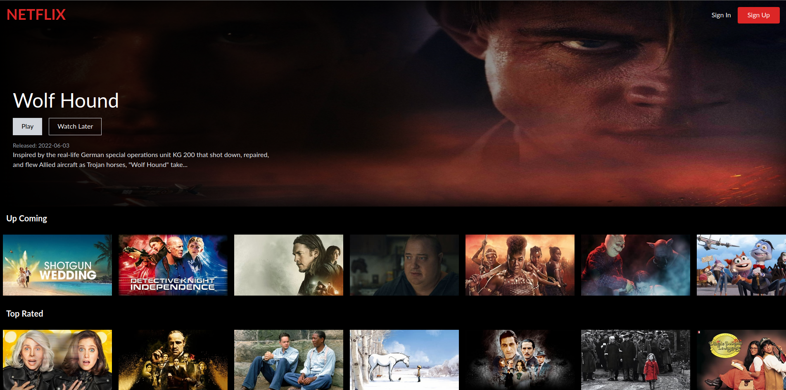
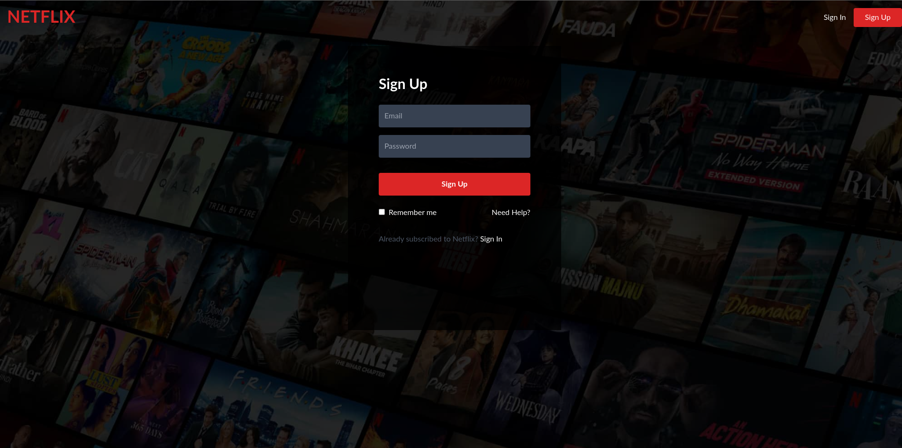
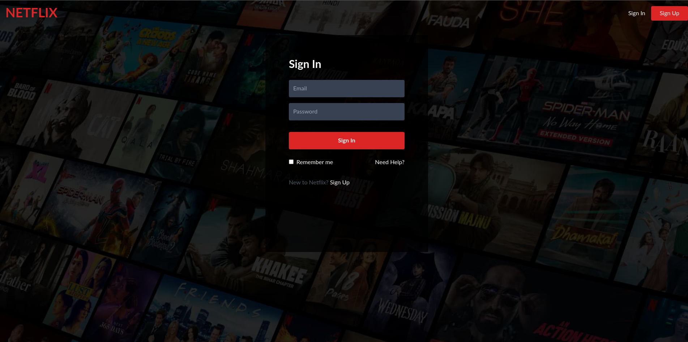
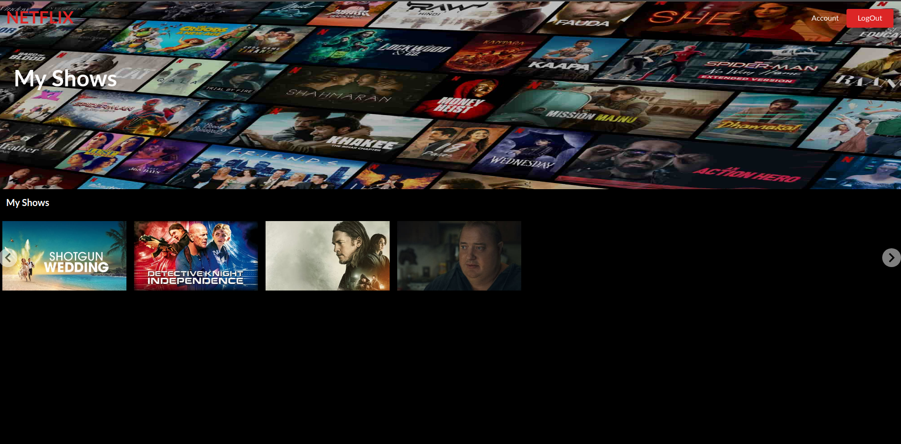

# Netflix-clone

Stack - Reactjs & Firebase

Netflix Movie clone Website using Reactjs and Firebase

website - netflix-clone-b6d3d.web.app/

## Table of Contents
- [Netflix-clone](#netflix-clone)
  - [Table of Contents](#table-of-contents)
  - [General info](#general-info)
  - [Libraries Used](#libraries-used)
  - [Technologies](#technologies)
  - [Setup](#setup)
  - [Examples](#examples)
    - [Home Page](#home-page)
    - [Authentication Page:](#authentication-page)
- [](#)
    - [Account page :](#account-page-)

## General info
Netflix Clone - movie Application Clone using Reactjs. In this Netflix App clone I have cloned maximum pages Home page, Account page, My shows etc...

As it is frontend & Backend clone I have added data can be changed easily or added easily.

## Libraries Used
|Library Name | Description|
| ----------- | ---------- | 
| Reactjs | Frontend Framework|
| react-router-dom | navigation library|
| tailwindcss | utility based css |
| react-redux | state management |
| axios | Promise based HTTP client for the browser |
| Firebase | backend Framework |
| tmdb | movie-api |

## Technologies
|Tool Name | Description |
| ------- | -------------|
| Reactjs | Reactjs is a development environment tool|
|npm | Package Manager tool|
| Firebase | app development platform |


## Setup
To run this project, install it locally using npm or yarn:

```
  $ npm install
```
start the project
```
$ npm start
```


## Examples
### Home Page



<br>

### Authentication Page:



=======
>>>>>>> cbe575b82b8d28cef899c12361a2e13ad88c7bec

<br>

### Account page :
